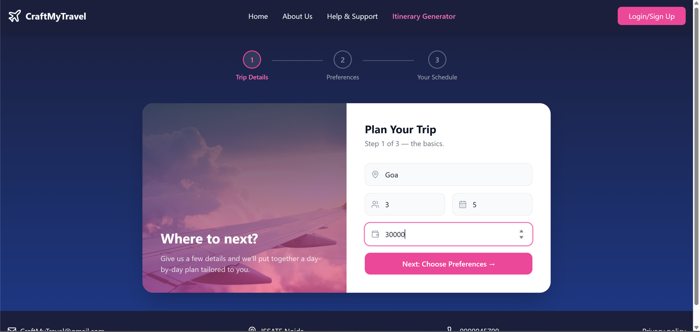
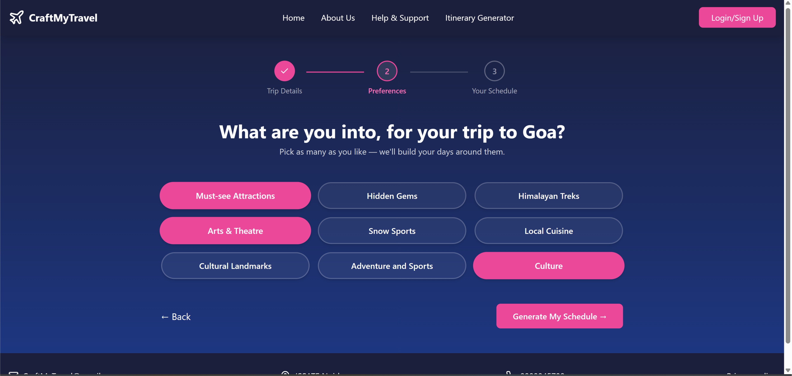
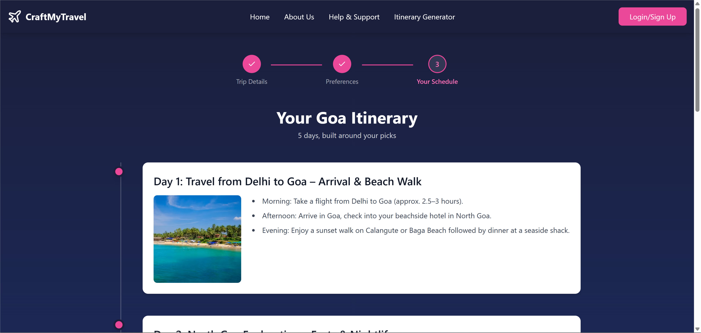
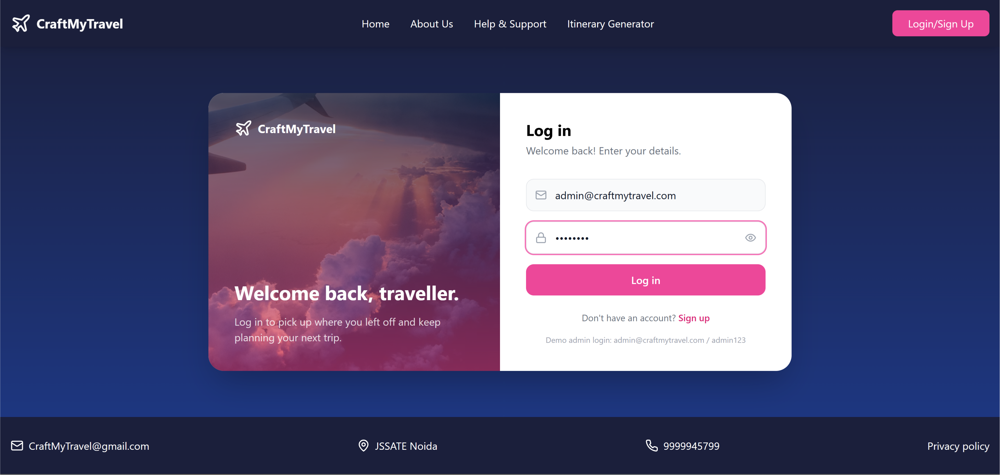
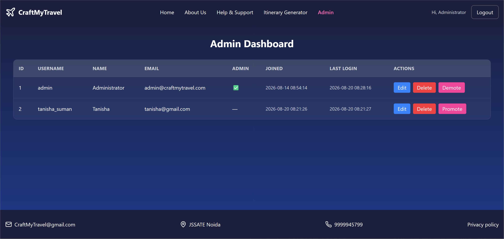

<div align="center">

# ✈️ CraftMyTravel

**Plan a personalized, day-by-day travel itinerary in minutes.**

Tell it where you're going, for how long, with how many people, and what
you're into — it hands back a full trip schedule. Includes account
signup/login and an admin dashboard for managing users.

</div>

---

## 📸 Screenshots


| | |
|---|---|
| **Landing Page** <br>  | **Plan Your Trip** <br>  |
| **Preferences** <br>  | **Generated Schedule** <br>  |
| **Login / Sign Up** <br>  | **Admin Dashboard** <br>  |

---

## 🗂️ Project structure

This repo contains two independent projects:

```
CraftMyTravel/
├── frontend/   React + TypeScript + Vite + Tailwind (the UI)
├── backend/    Flask + SQLAlchemy REST API (auth, admin, itinerary generation)
└── screenshots/  ← put your screenshots here
```

```
backend/
├── app.py                 # Flask app factory, blueprint registration, default admin seed
├── config.py               # All configuration, read from environment variables
├── extensions.py           # Shared SQLAlchemy instance
├── models.py                # User, POI, ItineraryRequest ORM models
├── auth_utils.py            # JWT helpers + @token_required / @admin_required decorators
├── auth_routes.py           # POST /api/signup, POST /api/login, GET /api/me
├── admin_routes.py          # /api/admin/* user management + analytics
├── itinerary_routes.py      # /api/itinerary/* generation endpoints
├── itinerary_service.py     # Curated-JSON lookup + preference-aware fallback generator
├── fetcher.py                # Optional Foursquare/Wikipedia/Unsplash enrichment
├── data/*.json               # Curated day-by-day itineraries
├── tests/test_api.py         # pytest suite covering auth, admin and itinerary endpoints
├── requirements.txt
└── .env.example

frontend/
├── src/
│   ├── axios.ts              # Shared API client (base URL + auto auth header)
│   ├── App.tsx                # Route definitions
│   ├── components/
│   │   ├── Navbar.tsx          # Shared nav — used on every page, login-aware
│   │   ├── Footer.tsx          # Shared footer — used on every page
│   │   └── TripStepper.tsx     # 3-step progress indicator for the planner flow
│   └── pages/                 # LandingPage, LoginPage, SignUpPage, ItineraryPage,
│                               # PreferencesPage, SchedulePage, AdminPanel, AboutUsPage,
│                               # HelpSupportPage
├── public/data/*.json          # Same curated itineraries, used as static fallback data
└── .env.example
```

---

## ✨ Features

- **Working, consistent navigation everywhere** — a single shared navbar/footer
  is used across every page. The logo always links back home, and the nav
  shows "Hi, {name} / Logout" once you're logged in.
- **Interactive destination picker** on the landing page — click any city
  pill (Kashmir, Shimla, Goa, Manali, Dehradun, Jaipur) to see its
  description and photo, with a "Plan a trip to X" button that jumps
  straight into the planner with that destination pre-filled.
- **A real 3-step "Plan Your Trip" wizard** — Trip Details → Preferences →
  Schedule, with a progress stepper so you always know where you are, and a
  working Back button that doesn't lose your data.
- **Itinerary generation, backed by a real API**
  - Curated, hand-written itineraries for 9 popular Indian destinations
    (Goa, Jaipur, Manali, Kashmir, Amritsar, Haridwar, Mathura, Pondicherry)
    across different trip lengths.
  - A **generic fallback generator** for any destination/day combination
    that doesn't have a curated plan, which tailors activities to the
    preferences you picked (local cuisine, adventure, culture, etc.) so the
    app never dead-ends.
- **Authentication** — signup/login with hashed passwords and JWT-based
  sessions.
- **Admin dashboard** — list, edit, delete and promote/demote users
  (protected, admin-only API routes).
- **Optional live data enrichment** — an admin-only endpoint that can pull
  real points of interest from the Foursquare Places API, enrich them with
  a Wikipedia summary and an Unsplash photo, and store them for future use.
  Fully optional; the app works out of the box without any API keys.

---

## 🛠️ Tech stack

| Layer     | Tech |
|-----------|------|
| Frontend  | React 18, TypeScript, Vite, Tailwind CSS, React Router, Axios, react-toastify, lucide-react |
| Backend   | Flask, Flask-SQLAlchemy, Flask-CORS, PyJWT, Werkzeug (password hashing) |
| Database  | SQLite by default (swap in Postgres/MySQL via `DATABASE_URL`) |
| Auth      | JWT bearer tokens |

---

## 🚀 Getting started

### 1. Backend

```bash
cd backend
python -m venv venv
source venv/bin/activate        # Windows: venv\Scripts\activate

pip install -r requirements.txt

cp .env.example .env            # then edit SECRET_KEY etc. if you like
python app.py                   # runs on http://localhost:5050
```

On first run the backend automatically creates the SQLite database and a
default admin account:

```
email:    admin@craftmytravel.com
password: admin123
```

**Change this password** (or set `DEFAULT_ADMIN_PASSWORD` in `.env` before
the first run) before deploying anywhere public.

Run the test suite:

```bash
pytest
```

### 2. Frontend

```bash
cd frontend
npm install

cp .env.example .env            # points at http://localhost:5050/api by default
npm run dev                     # runs on http://localhost:5173 (or the next free port)
```

Open the URL Vite prints in your terminal — the app is now talking to your
local backend.

### 3. Try it out

1. Sign up for an account, or log in as the default admin above.
2. On the landing page, click a destination pill (e.g. "Goa") to see its
   description, then hit "Plan a trip to Goa."
3. Fill in group size, days and budget, pick a few preferences, and watch
   the schedule build.
4. Log in as the admin account and visit `/admin` to manage users.

---

## ⚙️ Environment variables

### backend/.env

| Variable | Default | Purpose |
|---|---|---|
| `SECRET_KEY` | `dev-secret-key-change-me` | Signs JWT tokens — set a real random value |
| `JWT_EXPIRES_HOURS` | `24` | How long a login session lasts |
| `DATABASE_URL` | local SQLite file | Swap in Postgres/MySQL for production |
| `CORS_ORIGINS` | `*` | Comma-separated list of allowed frontend origins, or `*` for any (safe here — auth uses JWT bearer tokens, not cookies) |
| `DEFAULT_ADMIN_USERNAME` / `_EMAIL` / `_PASSWORD` | `admin` / `admin@craftmytravel.com` / `admin123` | Seeded admin account |
| `FOURSQUARE_API_KEY` | _(empty)_ | Optional — enables `/api/admin/fetch-pois` |
| `UNSPLASH_ACCESS_KEY` | _(empty)_ | Optional — used alongside Foursquare fetching |

### frontend/.env

| Variable | Default | Purpose |
|---|---|---|
| `VITE_API_URL` | `http://localhost:5050/api` | Base URL the frontend calls |

---

## 📡 API reference

All routes are prefixed with `/api`. Protected routes expect
`Authorization: Bearer <token>`.

| Method | Route | Auth | Description |
|---|---|---|---|
| POST | `/signup` | – | Create an account |
| POST | `/login` | – | Log in, returns a JWT + user profile |
| GET | `/me` | user | Get the logged-in user's profile |
| GET | `/itinerary/<destination>/<days>` | – | Get a schedule (curated if available, generated otherwise). Optional `?preferences=a,b,c` |
| POST | `/itinerary/generate` | – | Same as above via JSON body: `{ destination, days, people, budget, preferences[] }` |
| GET | `/itinerary/destinations` | – | List all destination/day combos with curated data |
| GET | `/admin/users` | admin | List all users |
| PUT | `/admin/users/<id>` | admin | Edit a user |
| DELETE | `/admin/users/<id>` | admin | Delete a user |
| POST | `/admin/users/<id>/toggle-admin` | admin | Promote/demote a user |
| GET | `/admin/itinerary-requests` | admin | Recent itinerary searches (basic analytics) |
| POST | `/admin/fetch-pois` | admin | Pull live POIs for a destination (requires `FOURSQUARE_API_KEY`) |
| GET | `/health` | – | Health check |

---

## 📦 Deployment notes

- **Backend**: run behind a production WSGI server (e.g. `gunicorn app:app`),
  set a real `SECRET_KEY`, a persistent `DATABASE_URL`, and restrict
  `CORS_ORIGINS` to your actual frontend domain instead of `*`.
- **Frontend**: `npm run build` produces a static `dist/` folder — deploy it
  to any static host (Vercel, Netlify, S3 + CloudFront, etc.) and set
  `VITE_API_URL` to your deployed backend URL at build time.

---

## 🩺 Troubleshooting

**"Network Error" on signup/login/schedule**
- Confirm the backend is running: `curl http://localhost:5050/api/health`
  should return `{"status":"ok"}`.
- If that fails to connect, the backend isn't running, or another project
  is already using port 5050 — start it and check the terminal for errors.

**CORS error in the browser console**
- Check `backend/.env` — `CORS_ORIGINS` should be `*` (the default) unless
  you deliberately locked it down. If you changed it to a specific origin
  list, make sure it includes whatever port your frontend is actually
  running on (check the `npm run dev` terminal output).
- Restart the backend after changing `.env` — it's only read on startup.

**Port already in use**
- The backend defaults to **port 5050** specifically to avoid colliding
  with other local projects that commonly use 5000. If 5050 is also taken,
  change it in `backend/app.py` (`app.run(..., port=5050)`) and update
  `VITE_API_URL` in `frontend/.env` to match.

---

## 🔭 Known limitations / next steps

- Curated itineraries only exist for 9 destinations; everything else uses
  the generic fallback generator described above.
- The admin dashboard is a functional table, not a polished UI — a good
  next step if you want to extend the project further.
- No password-reset flow yet.

---

## 📄 License

This project is provided as-is for learning purposes.
